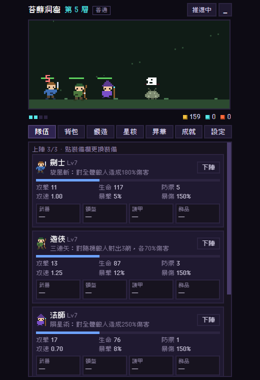

# 《口袋深淵 Pocket Abyss》— 迷你像素放置RPG

> 靈感來自《TBH：塔斯克巴·英雄》：保留「像素風」與「終極迷你放置RPG」的靈魂，
> 其餘全部重新設計 —— 把橫向章節冒險，換成一場**往下無盡挖掘的深淵遠征**。

把它縮在螢幕一角，你的像素小隊就會自動往深淵下潛：
自動戰鬥、自動撿裝、自動變強。你偶爾回來換個裝、鑲顆星核、點個天賦，
然後繼續上班 —— 深淵不會停。



---

## 一、核心概念

| 項目 | 設計 |
|---|---|
| 類型 | 迷你視窗放置RPG（掛機砍殺 + 配裝 + 轉生） |
| 畫面 | 純程式繪製像素風（Canvas，繁中像素字型 Cubic 11） |
| 打擊感 | 火花四濺、隕石火雨、爆碎粒子、擊退、暴擊放大數字、螢幕震動 |
| 視窗 | 建議 420×700 的小窗；一鍵切換「迷你模式」只剩一條戰鬥橫幅 |
| 平台 | 純 HTML/CSS/JS，零依賴、零安裝，`啟動遊戲.bat` 直接開成獨立小窗 |
| 進度 | localStorage 自動存檔；關閉後照樣結算離線收益（上限可擴充） |

## 二、世界：無盡深淵

不是章節，是**深度**。每 25 層一個生態區，8 區一個輪迴（200 層），
輪迴之後同樣的深淵以更兇惡的姿態重現 —— 對應 4 種難度：

- 第 1 輪迴：**普通** ／ 第 2：**惡夢** ／ 第 3：**煉獄** ／ 第 4 起：**超越 N**

8 大生態區（各有專屬怪物群與配色）：
苔蘚洞窟 → 幽暗密林 → 廢棄礦坑 → 熔岩裂谷 → 寒霜墓穴 → 毒沼澤地 → 星隕遺跡 → 虛空邊境

每層清完數波怪物自動下一層；**每 10 層一個 Boss**，掉落必然不俗。
全滅不懲罰進度，小隊撤退喘口氣再打；連敗會自動退一層休整。

- 怪物：10 種像素原型 × 各區變體 + 8 大 Boss，**共 56 種**。

## 三、小隊：六職業，上陣三人

| 職業 | 定位 | 自動技能 |
|---|---|---|
| 劍士 | 均衡近戰 | 旋風斬：對全體敵人 180% 傷害 |
| 遊俠 | 高暴擊射手 | 三連矢：3 發 70% 隨機射擊 |
| 法師 | 大範圍爆發 | 隕星術：250% 全體轟炸 |
| 牧師（15層解鎖） | 治療 | 聖光禱言：全隊回復 30% 生命 |
| 盜賊（30層解鎖） | 極速刺客 | 背刺：300% 必定暴擊 |
| 騎士（45層解鎖） | 重甲坦克 | 壁壘：全隊獲得護盾 |

自由換上陣組合，各自獨立升級、獨立配裝（武器／頭盔／護甲／飾品 4 格）。

## 四、戰利品：44 基底 × 12 品質 = 500+ 道具

品質 12 階（對應原作的超長品質梯）：

**粗糙 → 普通 → 優良 → 稀有 → 史詩 → 傳說 → 神話 → 永恆 → 星辰 → 深淵 → 混沌 → 創世**

- 品質越高：屬性倍率越高、詞綴越多（最多 6 條）、越可能自帶插槽。
- 詞綴池 16 種：攻擊％、生命％、暴擊、攻速、吸血、金幣、經驗、掉落、魔尋、
  技能急速、治療強度、反傷、全屬性……
- 裝備等級 = 掉落樓層，越深越強。

## 五、星核系統（本作的「魔方」）

Boss 會掉**星核** —— 7 系 × 5 階（碎片／凝聚／輝耀／燦爛／奇點）：

烈焰（攻擊）、磐石（防禦）、疾風（攻速）、銳目（暴擊）、血月（吸血）、貪婪（金幣）、智慧（經驗）

- **三合一熔合**：3 顆同系同階 → 1 顆上一階（數值 ×2）。
- 鑲進裝備插槽自訂屬性；鍛造所可**鑿孔**（最多 3 孔）、可付星塵取回星核。

## 六、鍛造所

分解不要的裝備得**星塵**，用星塵：

- **升品**：品質 +1 階（屬性重算、可能長出新詞綴）
- **重鑄**：重骰全部詞綴
- **鑿孔**：追加插槽（最多 3）

## 七、昇華（轉生）

抵達 40 層後可**昇華**：深度化為**餘燼**，樓層與等級歸零，
裝備、星核、星塵、成就全數保留。餘燼點永久天賦（10 系）：

全屬性、攻擊、生命、金幣、經驗、掉落、星核掉率、離線上限 +2h/級、
**先遣部隊（起始樓層 +5/級）**、鍛造折扣。

## 八、成就 52 種

屠戮、深潛、Boss 獵殺、財富、收藏、品質獵人、熔合、昇華、等級……
每個成就 +1 成就點：**每點全隊全屬性 +0.5%、金幣 +1%**，永久生效。

## 九、放著就好

- 離線收益：按你最近的擊殺效率結算金幣／經驗／戰利品（基礎上限 8 小時，天賦可到 20）。
- 自動推進可開關（想蹲在某層刷裝就關掉）。
- 低品質自動分解門檻可設定，背包不爆炸。
- 迷你模式：整個遊戲縮成一條 420×230 的戰鬥橫幅，貼在螢幕角落。

---

## 啟動方式

- 雙擊 **`啟動遊戲.bat`**：以 Edge 應用模式開一個無邊框小窗（推薦）。
- 或直接用瀏覽器開 `index.html`。

## 測試

```
node test/smoke.js
```

無頭模擬 4 小時掛機，驗證資料完整性、戰鬥推進、鍛造、星核、昇華、
離線收益與存檔序列化，並檢查深層數值不會溢出。

## 專案結構

```
index.html        主頁面
css/style.css     像素UI主題
js/sprites.js     像素圖庫與繪製（角色/怪物/迷你數字字型）
js/data.js        全部數值資料（職業/區域/怪物/裝備/詞綴/星核/天賦/成就）
js/game.js        核心邏輯（戰鬥模擬/掉寶/鍛造/昇華/離線/存檔）——無 DOM，可獨立測試
js/ui.js          介面渲染與互動
js/main.js        開機與主迴圈
fonts/            Cubic 11 繁中像素字型（開源）
test/smoke.js     Node 無頭煙霧測試（模擬掛機數千刻）
```
